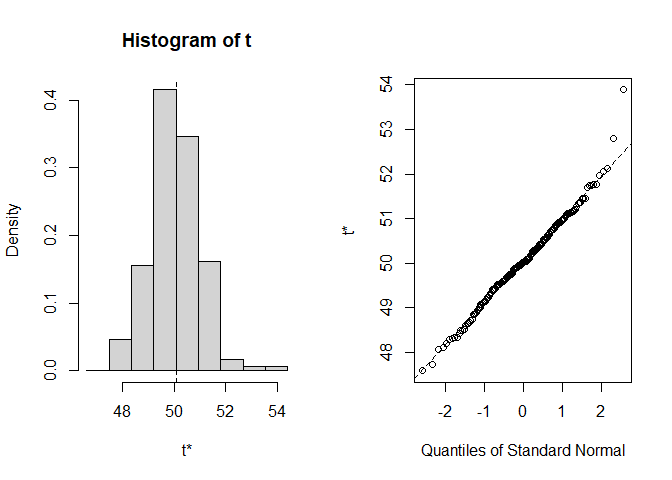
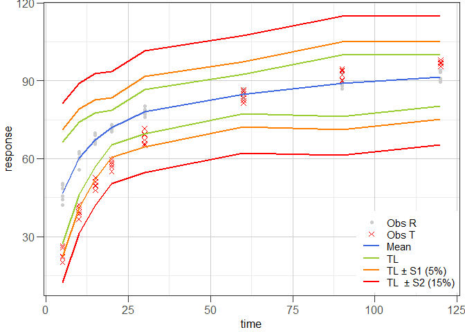
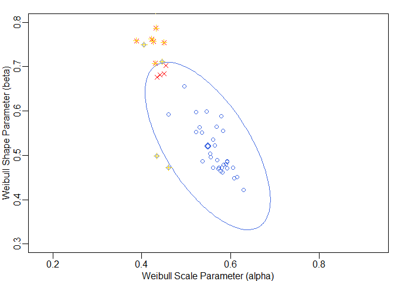
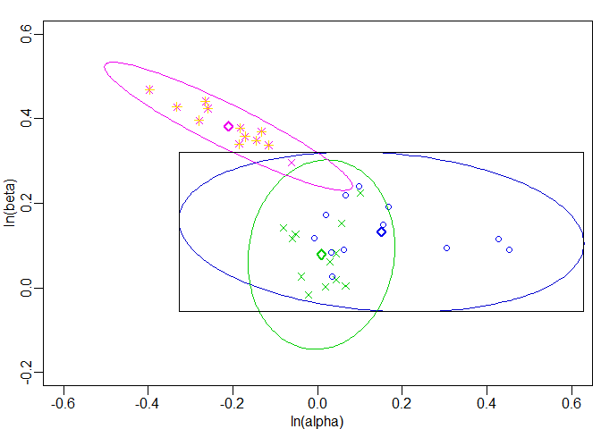

<!-- README.md is generated from README.Rmd. Please edit that file -->

# disprofas

<!-- badges: start -->
<!-- badges: end -->

Functions for the determination of similarity of highly variable
dissolution profiles of two drug formulations are provided. Estimation
of *f*<sub>1</sub>, *f*<sub>2</sub> and bootstrap *f*<sub>2</sub> is
implemented. In addition, functions following the model-independent MCR
(multivariate confidence region) procedure and the *T*<sup>2</sup>-test
for equivalence procedure are available.

## Installation

A stable version of `disprofas` can be installed from CRAN:

``` r
install.packages("disprofas")
```

The development version is available from
[GitHub](https://github.com/piusdahinden/disprofas) by:

``` r
# install.packages("devtools")
# devtools::install_github("piusdahinden/disprofas")
```

## Examples

### Example 1

*Example 1* illustrates how to solve a common problem by aid of the
bootstrap *f*<sub>2</sub> procedure proposed by Shah et al. (1998) using
a data set containing the dissolution data of one reference batch and
one test batch of *n* = 12 tablets each, i.e. the dissolution profiles
of the % drug release observed at 0, 30, 60, 90 and 180 minutes (See
Shah et al. (1998), Table 4).

``` r
library(disprofas)
#> Warning: Paket 'disprofas' wurde unter R Version 4.6.0 erstellt

# Data frame
str(dip2)
#> 'data.frame':    72 obs. of  8 variables:
#>  $ type  : Factor w/ 2 levels "Reference","Test": 1 1 1 1 1 1 1 1 1 1 ...
#>  $ tablet: Factor w/ 12 levels "1","2","3","4",..: 1 2 3 4 5 6 7 8 9 10 ...
#>  $ batch : Factor w/ 6 levels "b0","b1","b2",..: 1 1 1 1 1 1 1 1 1 1 ...
#>  $ t.0   : int  0 0 0 0 0 0 0 0 0 0 ...
#>  $ t.30  : num  36.1 33 35.7 32.1 36.1 34.1 32.4 39.6 34.5 38 ...
#>  $ t.60  : num  58.6 59.5 62.3 62.3 53.6 63.2 61.3 61.8 58 59.2 ...
#>  $ t.90  : num  80 80.8 83 81.3 72.6 83 80 80.4 76.9 79.3 ...
#>  $ t.180 : num  93.3 95.7 97.1 92.8 88.8 97.4 96.8 98.6 93.3 94 ...

# Perform estimation and print a summary
res1 <- bootstrap_f2(data = dip2[dip2$batch %in% c("b0", "b4"), ],
                         tcol = 5:8, grouping = "batch",
                         rr = 200, new_seed = 421, use_ema = "no")

class(res1)
#> [1] "bootstrap_f2"
summary(res1)
#> 
#> STRATIFIED BOOTSTRAP
#> 
#> 
#> Call:
#> boot(data = data, statistic = get_f2, R = rr, strata = data[, 
#>     grouping], grouping = grouping, tcol = tcol[ok])
#> 
#> 
#> Bootstrap Statistics :
#>     original      bias    std. error
#> t1* 50.07187 -0.02553234   0.9488015
#> 
#> 
#> BOOTSTRAP CONFIDENCE INTERVAL CALCULATIONS
#> Based on 200 bootstrap replicates
#> 
#> CALL : 
#> boot.ci(boot.out = t_boot, conf = confid, type = "all", L = jack$loo.values)
#> 
#> Intervals : 
#> Level      Normal              Basic         
#> 90%   (48.54, 51.66 )   (48.46, 51.71 )  
#> 
#> Level     Percentile            BCa          
#> 90%   (48.43, 51.68 )   (48.69, 51.99 )  
#> Calculations and Intervals on Original Scale
#> Some BCa intervals may be unstable
#> 
#> 
#> Shah's lower 90% BCa confidence interval:
#>  48.64613

# Prepare a graphical representation
plot(res1)
```



    #> 
    #> Shah's lower 90% BCa confidence interval:
    #>  48.64613

### Example 2

*Example 2* illustrates how to solve a common problem by aid of the
model-independent non-parametric multivariate confidence region (MCR)
procedure proposed by Tsong et al. (1996) using a data set containing
the dissolution data of one reference batch and one test batch of *n* =
6 tablets each, i.e. the dissolution profiles of the % drug release
observed at 5, 10, 15, 20, 30, 60, 90 and 120 minutes (see Tsong et
al. (1996), Table 1).

``` r
library(disprofas)

# Data frame
str(dip3)
#> 'data.frame':    24 obs. of  6 variables:
#>  $ cap  : Factor w/ 12 levels "1","2","3","4",..: 1 2 3 4 5 6 7 8 9 10 ...
#>  $ batch: Factor w/ 2 levels "blue","white": 2 2 2 2 2 2 2 2 2 2 ...
#>  $ type : Factor w/ 2 levels "ref","test": 1 1 1 1 1 1 1 1 1 1 ...
#>  $ x.15 : num  49 15 56 57 6 62 23 11 9 42 ...
#>  $ x.20 : num  86 59 84 87 58 90 71 64 61 81 ...
#>  $ x.25 : num  98 96 96 99 90 97 97 92 88 96 ...

# Perform estimation and print a summary
res2 <- mimcr(data = dip3, tcol = 4:6, grouping = "batch")

class(res2)
#> [1] "mimcr"
summary(res2)
#> 
#> Results of Model-Independent Multivariate Confidence Region (MIMCR) 
#> approach to assess equivalence of highly variable in-vitro 
#> dissolution profiles of two drug product formulations
#> 
#> Did the Newton-Raphson search converge? Yes
#> Are the points located on the confidence region boundary (CRB)? Yes
#> 
#> Parameters (general): 
#> Significance level:                   0.05 
#> Degrees of freedom (1):               3 
#> Degrees of freedom (2):               20 
#> Mahalanobis distance (MD):            0.2384 
#> (F) scaling factor K:                 1.818 
#> (MD) scaling factor k:                6 
#> Hotelling's T2:                       0.341
#> 
#> Parameters specific for Tsong (1996) approach: 
#> Maximum tolerable average difference: 10 
#> Similarity limit:                     2.248 
#> Observed upper limit:                 1.544
#> 
#> Parameters specific for Hoffelder (2016) approach: 
#> Noncentrality parameter:              30.32 
#> Critial F (Hoffelder):                4.899 
#> Probability p (Hoffelder):            2.891e-08
#> 
#> Conclusions: 
#>       Tsong (1996):  Similar 
#>   Hoffelder (2016):  Similar
```

### Example 3

*Example 3* illustrates how to solve a common problem by aid of the
*T*<sup>2</sup>-test for equivalence procedure proposed by Hoffelder
(2016) using a data set containing the dissolution data of one reference
batch and one test batch of *n* = 12 capsules each, i.e. the dissolution
profiles of the % drug release observed at 15, 20 and 25 minutes (see
Hoffelder (2016), Figure 1 (data not shown in publication, but the data
set is available on CRAN, package
[T2EQ](https://CRAN.R-project.org/package=T2EQ), data set
`ex_data_pharmind`)).

``` r
library(disprofas)

# Data frame
str(dip4)
#> 'data.frame':    24 obs. of  4 variables:
#>  $ type: Factor w/ 2 levels "ref","test": 1 1 1 1 1 1 1 1 1 1 ...
#>  $ x.10: num  30 10 32 50 16 17 47 37 41 42 ...
#>  $ x.20: num  76 59 77 90 64 77 87 83 82 78 ...
#>  $ x.30: num  97 96 97 98 95 96 98 98 98 98 ...

# Perform estimation and print a summary
res3 <- mimcr(data = dip4, tcol = 2:4, grouping = "type")
summary(res3)
#> 
#> Results of Model-Independent Multivariate Confidence Region (MIMCR) 
#> approach to assess equivalence of highly variable in-vitro 
#> dissolution profiles of two drug product formulations
#> 
#> Did the Newton-Raphson search converge? Yes
#> Are the points located on the confidence region boundary (CRB)? Yes
#> 
#> Parameters (general): 
#> Significance level:                   0.05 
#> Degrees of freedom (1):               3 
#> Degrees of freedom (2):               20 
#> Mahalanobis distance (MD):            2.824 
#> (F) scaling factor K:                 1.818 
#> (MD) scaling factor k:                6 
#> Hotelling's T2:                       47.85
#> 
#> Parameters specific for Tsong (1996) approach: 
#> Maximum tolerable average difference: 10 
#> Similarity limit:                     17.18 
#> Observed upper limit:                 4.129
#> 
#> Parameters specific for Hoffelder (2016) approach: 
#> Noncentrality parameter:              1770 
#> Critial F (Hoffelder):                373.5 
#> Probability p (Hoffelder):            8.428e-110
#> 
#> Conclusions: 
#>       Tsong (1996):  Similar 
#>   Hoffelder (2016):  Similar
```

### Example 4

*Example 4* illustrates the tolerance interval approach proposed by
Martinez & Zhao (2018) using the data set that was used in *Example 1*.
In the graphical representation of the data, the data points of the
reference batch are shown as grey dots, the data points of the test
batch as red crosses, the average time course is shown as blue line and
the associated tolerance interval limits (*TL*) as green, orange and red
lines that are drawn at *TL*, *TL* ± S1 (5%) and *TL* ± S2 (15%),
respectively.

``` r
library(disprofas)

# Data frame
str(dip1)
#> 'data.frame':    12 obs. of  10 variables:
#>  $ type  : Factor w/ 2 levels "R","T": 1 1 1 1 1 1 2 2 2 2 ...
#>  $ tablet: Factor w/ 6 levels "1","2","3","4",..: 1 2 3 4 5 6 1 2 3 4 ...
#>  $ t.5   : num  42.1 44.2 45.6 48.5 50.5 ...
#>  $ t.10  : num  59.9 60.2 55.8 60.4 61.8 ...
#>  $ t.15  : num  65.6 67.2 65.6 66.5 69.1 ...
#>  $ t.20  : num  71.8 70.8 70.5 73.1 72.8 ...
#>  $ t.30  : num  77.8 76.1 76.9 78.5 79 ...
#>  $ t.60  : num  85.7 83.3 83.9 85 86.9 ...
#>  $ t.90  : num  93.1 88 86.8 88 89.7 ...
#>  $ t.120 : num  94.2 89.6 90.1 93.4 90.8 ...

# Perform estimation and print a summary
res4 <- mztia(data = dip1, shape = "wide", tcol = 3:10, grouping = "type",
                reference = "R")

class(res4)
#> [1] "mztia"
summary(res4)
#> 
#> Results of Martinez & Zhao Tolerance Interval (TI) Approach
#> (TI limits calculated at each time point of the dissolution profiles of a set of reference batches)
#> 
#>   Time     Mean      LTL       UTL   S1.LTL    S1.UTL   S2.LTL    S2.UTL
#> 1    5 46.77167 27.22641  66.31693 22.22641  71.31693 12.22641  81.31693
#> 2   10 60.13333 46.15483  74.11184 41.15483  79.11184 31.15483  89.11184
#> 3   15 67.27500 56.90417  77.64583 51.90417  82.64583 41.90417  92.64583
#> 4   20 71.98667 65.44354  78.52979 60.44354  83.52979 50.44354  93.52979
#> 5   30 78.07000 69.54259  86.59741 64.54259  91.59741 54.54259 101.59741
#> 6   60 84.81667 77.20275  92.43058 72.20275  97.43058 62.20275 107.43058
#> 7   90 89.09333 76.24588 100.00000 71.24588 105.00000 61.24588 115.00000
#> 8  120 91.43833 80.29321 100.00000 75.29321 105.00000 65.29321 115.00000
#> 
#> Abbreviations:
#> TL: Tolerance Interval Limit (TL); LTL: lower TL; UTL: upper TL; S1: level 1 boundary (LTL - ) or (UTL + ); S2: level 2 boundary (LTL - ) or (UTL + ).

# Prepare a graphical representation
ggres4 <- plot_mztia(res4)
class(ggres4)
#> [1] "plot_mztia"
plot(ggres4)
```



### Example 5

*Example 5* illustrates how to solve a common problem by aid of the
model-dependent approach as proposed by Sathe, Tsong & Shah (1996) or by
Tsong, Hammerstrom & Chen (1997).

#### Example 5a

In *Example 5a*, the data set shown in Table 4 of Tsong, Hammerstrom &
Chen (1997) is used which contains the Weibull parameter estimates
obtained from fitting of Weibull curves to the cumulative dissolution
profiles of individual tablets of three reference batches and one test
batch of *n* = 12 tablets each. First, a one-sample *T*<sup>2</sup>-test
is performed with the Weibull parameters of the reference group only,
followed by a two-sample *T*<sup>2</sup>-test to compare the Weibull
parameters of the reference batches with the Weibull parameters of the
test batch.

``` r
library(disprofas)

str(dip7)
#> 'data.frame':    48 obs. of  5 variables:
#>  $ tablet: Factor w/ 12 levels "1","2","3","4",..: 1 2 3 4 5 6 7 8 9 10 ...
#>  $ batch : Factor w/ 4 levels "b1","b2","b3",..: 1 1 1 1 1 1 1 1 1 1 ...
#>  $ type  : Factor w/ 2 levels "ref","test": 1 1 1 1 1 1 1 1 1 1 ...
#>  $ alpha : num  0.583 0.496 0.571 0.579 0.593 ...
#>  $ beta  : num  0.555 0.655 0.489 0.588 0.485 ...
t_param <- c("alpha", "beta")

# One-sample T2 test with only the reference data
res1 <- get_T2_one(m = as.matrix(dip7[dip7$type == "ref", t_param]),
                   mu = colMeans(as.matrix(dip7[dip7$type == "test", t_param])),
                   signif = 0.05)

# Two-sample T2 test comparing the reference with the test data
res2 <- get_T2_two(m1 = as.matrix(dip7[dip7$type == "ref", t_param]),
                   m2 = as.matrix(dip7[dip7$type == "test", t_param]),
                   signif = 0.05)

# Estimates
res1$Parameters
#>         dm        df1        df2     signif          K          k         T2 
#>   3.027907   2.000000  34.000000   0.050000  17.485714  36.000000 330.055950 
#>          F     F.crit     t.crit        p.F 
#> 160.312890   3.275898   2.341969   0.000000
res2$Parameters
#>           dm          df1          df2       signif            K            k 
#> 3.247275e+00 2.000000e+00 4.500000e+01 5.000000e-02 4.402174e+00 9.000000e+00 
#>           T2            F       F.crit       t.crit          p.F 
#> 9.490313e+01 4.642001e+01 3.204317e+00 2.317152e+00 1.151701e-11
```

Since in the current example we have a two-dimensional situation, the
results can be illustrated graphically. Based on the reference batch
parameter estimates, a (1−*signif*)100% confidence region (*CR*) can be
constructed. All points on this *CR* have the same Mahalanobis distance.
This distance sets the upper confidence limit (*UCL*).

``` r
# Stretch factor
qfk <- as.numeric(sqrt(res2$Parameters["k"] / res2$Parameters["K"] *
                         res2$Parameters["F.crit"]))

# Cholesky decomposition, scaling and centering of confidence region
RR         <- chol(res2$covs$S.b1) # chol(res1$cov)
angles     <- seq(0, 2 * pi, length.out = 200)
ellipse    <- qfk[1] * cbind(cos(angles), sin(angles)) %*% RR
ellipseCtr <- sweep(ellipse, 2, res2$means$mean.b1, "+")

# Determination of ucl
ucl <- mahalanobis(x = ellipseCtr[1, ],
                   center = res2$means$mean.b1, cov = res2$covs$S.b1)
```

The *UCL* allows checking which points lie outside the *CR* and which
points lie inside.

``` r
# Determination of scores
scores <- c(mahalanobis(x = as.matrix(dip7[dip7$type == "ref", t_param]),
                        center = res2$means$mean.b1,
                        cov = res2$covs$S.b1),
            mahalanobis(x = as.matrix(dip7[dip7$type == "test", t_param]),
                        center = res2$means$mean.b1,
                        cov = res2$covs$S.b1))

# Check if scores are greater than ucl
is_out <- scores > ucl

# Points in the dip7 data frame lying outside the confidence region
dip7[is_out, ]
#>    tablet batch type   alpha    beta
#> 9       9    b1  ref 0.46120 0.47234
#> 16      4    b2  ref 0.44647 0.71136
#> 21      9    b2  ref 0.43405 0.49848
#> 28      4    b3  ref 0.40571 0.74920
#> 33      9    b3  ref 0.46120 0.47234
#> 37      1    b4 test 0.38827 0.75826
#> 38      2    b4 test 0.42679 0.75668
#> 39      3    b4 test 0.43043 0.70732
#> 42      6    b4 test 0.43187 0.82644
#> 45      9    b4 test 0.39666 0.82681
#> 46     10    b4 test 0.42297 0.76226
#> 47     11    b4 test 0.43270 0.78700
#> 48     12    b4 test 0.45036 0.75428
```

These results are displayed graphically in the following figure. The
points of the reference batches are shown as blue circles and the points
of the test batch as red crosses. The *CR* boundary is shown as blue
ellipse. The bold blue diamond represents the centre point of the
ellipse. The points that have been identified to lie outside the *CR*
are highlighted by yellow greek crosses.

``` r
op <- par(mar = c(2.5, 2.5, 1.2, 0.5), mgp = c(1.5, 0.5, 0), lwd = 1.5)
{
  plot(dip7[dip7$type == "ref", t_param], asp = 1,
       xlim = c(0.3, 0.8), ylim = c(0.3, 0.8), pch = 1, col = "royalblue",
       xlab = "Weibull Scale Parameter (alpha)",
       ylab = "Weibull Shape Parameter (beta)")
  points(dip7[dip7$type == "test", t_param], pch = 4, col = "red")
  points(res1$means$mean.r[1], res1$means$mean.r[2], pch = 5,
         col = "royalblue", lwd = 2)
  lines(ellipseCtr, col = "royalblue")
  
  # Highlight the points detected to lie outside the confidence region
  points(dip7[is_out, t_param], pch = 3, col = "gold")
}
```



#### Example 5b

In *Example 5b*, the data set shown in Table III of Sathe, Tsong & Shah
(1996) is used which contains the Weibull parameter estimates obtained
from fitting of Weibull curves to the cumulative dissolution profiles of
individual tablets of one reference batch and one test / post-change
batch with a minor modification and a second test / post-change batch
with a major modification, *n* = 12 tablets each. One-sample
*T*<sup>2</sup>-tests are performed with the Weibull parameters of the
reference and the two test groups separately.

``` r
library(disprofas)

str(dip8)
#> 'data.frame':    36 obs. of  4 variables:
#>  $ tablet: Factor w/ 12 levels "1","2","3","4",..: 1 2 3 4 5 6 7 8 9 10 ...
#>  $ type  : Factor w/ 3 levels "major","minor",..: 3 3 3 3 3 3 3 3 3 3 ...
#>  $ alpha : num  1.1 1.02 1.06 1.03 1.53 ...
#>  $ beta  : num  1.27 1.19 1.09 1.09 1.12 ...

d_dat <- dip8
d_dat[, c("alpha", "beta")] <- log(d_dat[, c("alpha", "beta")])
t_param <- c("alpha", "beta")

res1ref <-
  get_T2_one(m = as.matrix(d_dat[d_dat$type == "ref", t_param]),
             mu = colMeans(as.matrix(d_dat[d_dat$type == "ref", t_param])),
             signif = 0.05)
res1min <-
  get_T2_one(m = as.matrix(d_dat[d_dat$type == "minor", t_param]),
             mu = colMeans(as.matrix(d_dat[d_dat$type == "minor", t_param])),
             signif = 0.05)
res1maj <-
  get_T2_one(m = as.matrix(d_dat[d_dat$type == "major", t_param]),
             mu = colMeans(as.matrix(d_dat[d_dat$type == "major", t_param])),
             signif = 0.05)

# Estimates
res1ref$Parameters
#>        dm       df1       df2    signif         K         k        T2         F 
#>  0.000000  2.000000 10.000000  0.050000  5.454545 12.000000  0.000000  0.000000 
#>    F.crit    t.crit       p.F 
#>  4.102821  2.593093  1.000000
res1min$Parameters
#>        dm       df1       df2    signif         K         k        T2         F 
#>  0.000000  2.000000 10.000000  0.050000  5.454545 12.000000  0.000000  0.000000 
#>    F.crit    t.crit       p.F 
#>  4.102821  2.593093  1.000000
res1maj$Parameters
#>        dm       df1       df2    signif         K         k        T2         F 
#>  0.000000  2.000000 10.000000  0.050000  5.454545 12.000000  0.000000  0.000000 
#>    F.crit    t.crit       p.F 
#>  4.102821  2.593093  1.000000
```

Since in the current example we have a two-dimensional situation, the
results can be illustrated graphically. Based on the reference batch
parameter estimates, a (1−*signif*)100% confidence region (*CR*) or
similarity region, as it is called in the article from Sathe, Tsong &
Shah (1996), can be constructed. All points on this *CR* have the same
Mahalanobis distance. The distance obtained with the *CR* of the
reference batches sets the upper confidence limit (*UCL*).

``` r
# Stretch factor
qfk <- c(ref = as.numeric(sqrt(res1ref$Parameters["k"] /
                                 res1ref$Parameters["K"] *
                                 res1ref$Parameters["F.crit"])),
         min = as.numeric(sqrt(res1min$Parameters["k"] /
                                 res1min$Parameters["K"] *
                                 res1min$Parameters["F.crit"])),
         maj = as.numeric(sqrt(res1maj$Parameters["k"] /
                                 res1maj$Parameters["K"] *
                                 res1maj$Parameters["F.crit"])))

# Cholesky decomposition, scaling and centering of confidence region
# Cholesky decomposition, scaling and centering of ellipse
RR_ref         <- chol(res1ref$cov)
angles_ref     <- seq(0, 2 * pi, length.out = 200)
ellipse_ref    <- qfk["ref"] * cbind(cos(angles), sin(angles)) %*% RR_ref
ellipseCtr_ref <- sweep(ellipse_ref, 2, res1ref$means$mean.r, "+")

RR_min         <- chol(res1min$cov)
angles_min     <- seq(0, 2 * pi, length.out = 200)
ellipse_min    <- qfk["min"] * cbind(cos(angles), sin(angles)) %*% RR_min
ellipseCtr_min <- sweep(ellipse_min, 2, res1min$means$mean.r, "+")

RR_maj         <- chol(res1maj$cov)
angles_maj     <- seq(0, 2 * pi, length.out = 200)
ellipse_maj    <- qfk["maj"] * cbind(cos(angles), sin(angles)) %*% RR_maj
ellipseCtr_maj <- sweep(ellipse_maj, 2, res1maj$means$mean.r, "+")

# Determination of ucl
ucl <- mahalanobis(x = ellipseCtr_ref[1, ],
                   center = res1ref$means$mean.r, cov = res1ref$cov)
```

The *UCL* allows checking which points lie outside the *CR* and which
points lie inside of it.

``` r
# Determination of scores
scores <- c(mahalanobis(x = as.matrix(d_dat[d_dat$type == "ref", t_param]),
                        center = res1ref$means$mean.r,
                        cov = res1ref$cov),
            mahalanobis(x = as.matrix(d_dat[d_dat$type == "minor", t_param]),
                        center = res1ref$means$mean.r,
                        cov = res1ref$cov),
            mahalanobis(x = as.matrix(d_dat[d_dat$type == "major", t_param]),
                        center = res1ref$means$mean.r,
                        cov = res1ref$cov))

is_out <- scores > ucl

# Points in the dip8 data frame lying outside the confidence region
d_dat[is_out, ]
#>    tablet  type      alpha      beta
#> 25      1 major -0.3973333 0.4681895
#> 26      2 major -0.2649817 0.4406971
#> 27      3 major -0.3321635 0.4275201
#> 28      4 major -0.1325947 0.3697896
#> 30      6 major -0.1853662 0.3400800
#> 31      7 major -0.1443555 0.3481608
#> 32      8 major -0.1824936 0.3778198
#> 33      9 major -0.2800976 0.3955023
#> 34     10 major -0.1155680 0.3372220
#> 35     11 major -0.1714766 0.3574926
#> 36     12 major -0.2592760 0.4238353
```

Finally, the results collected above are displayed graphically for
illustration. The black rectangle represents the *3 STD Similarity
Region* as shown in Figure 4 in the article from Sathe, Tsong & Shah
(1996). The points of the reference batch are shown as blue circles, the
points of the minor modification batch as green crosses and the points
of the major modification batch as magenta crosses. The *CR* boundaries
are shown as ellipses that are coloured according to the corresponding
data points. The bold diamonds coloured according to the corresponding
data points represent the centre points of the ellipses. The points that
have been identified to lie outside the *CR* of the reference batch are
highlighted by yellow greek crosses.

``` r
op <- par(mar = c(2.5, 2.5, 1.2, 0.5), mgp = c(1.5, 0.5, 0), lwd = 1.5)
t_multiple <- 3

{
  plot(d_dat[d_dat$type == "ref", t_param], asp = 1,
       xlim = c(-0.6, 0.6), ylim = c(-0.2, 0.6), pch = 1, col = "blue2",
       xlab = "ln(alpha)", ylab = "ln(beta)")
  points(d_dat[d_dat$type == "minor", t_param], pch = 4, col = "green3")
  points(d_dat[d_dat$type == "major", t_param], pch = 4, col = "magenta2")
  points(res1ref$means$mean.r[1], res1ref$means$mean.r[2], pch = 5,
         col = "blue2", lwd = 2)
  points(res1min$means$mean.r[1], res1min$means$mean.r[2], pch = 5,
         col = "green3", lwd = 2)
  points(res1maj$means$mean.r[1], res1maj$means$mean.r[2], pch = 5,
         col = "magenta2", lwd = 2)
  lines(ellipseCtr_ref, col = "blue3")
  lines(ellipseCtr_min, col = "green3")
  lines(ellipseCtr_maj, col = "magenta2")
  rect(xleft = t_multiple * -sqrt(diag(res1ref$cov))["alpha"] +
         res1ref$means$mean.r["alpha"],
       ybottom = t_multiple * -sqrt(diag(res1ref$cov))["beta"] +
         res1ref$means$mean.r["beta"],
       xright = t_multiple * sqrt(diag(res1ref$cov))["alpha"] +
         res1ref$means$mean.r["alpha"],
       ytop = t_multiple * sqrt(diag(res1ref$cov))["beta"] +
         res1ref$means$mean.r["beta"])
  
  # Highlight the points detected to lie outside the confidence region
  points(d_dat[is_out, t_param], pch = 3, col = "gold")
}
```



## Cited Literature

1.  Shah, V. P., Tsong, Y., Sathe, P., and Liu, J. P. *In vitro*
    dissolution profile comparison - statistics and analysis of the
    similarity factor, *f*<sub>2</sub>. *Pharm Res*. 1998; **15**(6):
    889-896.
2.  Tsong, Y., Hammerstrom, T., Sathe, P.M., and Shah, V.P. Statistical
    assessment of mean differences between two dissolution data sets.
    *Drug Inf J*. 1996; **30**: 1105-1112.
3.  Hoffelder, T. Highly variable dissolution profiles. Comparison of
    *T*<sup>2</sup>-test for equivalence and *f*<sub>2</sub> based
    methods. *Pharm Ind*. 2016; **78**(4): 587-592.
4.  Martinez, M.N., and Zhao, X. A simple approach for comparing the *in
    vitro* dissolution profiles of highly variable drug products: a
    proposal. *AAPS Journal*. 2018; **20**: 78.
5.  Sathe, P.M., Tsong, Y., and Shah, V.P. *In-Vitro* dissolution
    profile comparison: Statistics and analysis, model dependent
    approach. *Pharm Res*. 1996; **13**(12): 1799-1803.
6.  Tsong, Y., Hammerstrom, T., Chen, J.J. Multipoint dissolution
    specification and acceptance sampling rule based on profile modeling
    and principal component analysis. *J Biopharm Stat*. 1997; **7**(3):
    423-439.

## Contact

[Pius Dahinden](https://github.com/piusdahinden), Tillotts Pharma AG

------------------------------------------------------------------------
