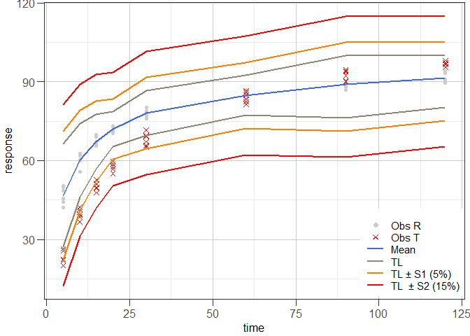

<!-- README.md is generated from README.Rmd. Please edit that file -->

# disprofas

<!-- badges: start -->
<!-- badges: end -->

Functions for the determination of similarity of highly variable
dissolution profiles of two drug formulations are provided. Estimation
of *f*\~1, *f*\~2 and bootstrap *f*\~2 is implemented. In addition,
functions following the model-independent MCR (multivariate confidence
region) procedure and the *T*^2-test for equivalence procedure are
available.

## Installation

**So far, the package has not yet been submitted to CRAN.** The
development version is available from
[GitHub](https://github.com/piusdahinden/disprofas). Installation from
this source is easily done by using ‘install\_github()’ function from
the ‘devtools’ package:

``` r
# install.packages("devtools")
devtools::install_github("tidyverse/ggplot2")
```

## Examples

### Example 1

*Example 1* illustrates how to solve a common problem by aid of the
bootstrap *f*\~2 procedure proposed by [Shah et
al. (1998)](https://doi.org/10.1023/A:1011976615750) using a data set
containing the dissolution data of one reference batch and one test
batch of *n* = 12 tablets each, i.e. the dissolution profiles of the %
drug release observed at 0, 30, 60, 90 and 180 minutes (See Shah et
al. (1998), Table 4).

``` r
library(disprofas)

# Data frame
str(dip2)
#> 'data.frame':    72 obs. of  8 variables:
#>  $ type  : Factor w/ 2 levels "Reference","Test": 1 1 1 1 1 1 1 1 1 1 ...
#>  $ tablet: Factor w/ 12 levels "1","2","3","4",..: 1 2 3 4 5 6 7 8 9 10 ...
#>  $ batch : Factor w/ 6 levels "b0","b1","b2",..: 1 1 1 1 1 1 1 1 1 1 ...
#>  $ t.0   : int  0 0 0 0 0 0 0 0 0 0 ...
#>  $ t.30  : num  36.1 33 35.7 32.1 36.1 34.1 32.4 39.6 34.5 38 ...
#>  $ t.60  : num  58.6 59.5 62.3 62.3 53.6 63.2 61.3 61.8 58 59.2 ...
#>  $ t.90  : num  80 80.8 83 81.3 72.6 83 80 80.4 76.9 79.3 ...
#>  $ t.180 : num  93.3 95.7 97.1 92.8 88.8 97.4 96.8 98.6 93.3 94 ...

# Perform estimation and print a summary
res1 <- bootstrap_f2(data = dip2[dip2$batch %in% c("b0", "b4"), ],
                         tcol = 5:8, grouping = "batch",
                         R = 200, new_seed = 421, useEMA = "no")

class(res1)
#> [1] "bootstrap_f2"
summary(res1)
#> 
#> STRATIFIED BOOTSTRAP
#> 
#> 
#> Call:
#> boot(data = data, statistic = get_f2, R = R, strata = data[, 
#>     grouping], grouping = grouping, tcol = tcol[ok])
#> 
#> 
#> Bootstrap Statistics :
#>     original      bias    std. error
#> t1* 50.07187 -0.02553234   0.9488015
#> 
#> 
#> BOOTSTRAP CONFIDENCE INTERVAL CALCULATIONS
#> Based on 200 bootstrap replicates
#> 
#> CALL : 
#> boot.ci(boot.out = t_boot, conf = confid, type = "all", L = jack$loo.values)
#> 
#> Intervals : 
#> Level      Normal              Basic         
#> 90%   (48.54, 51.66 )   (48.46, 51.71 )  
#> 
#> Level     Percentile            BCa          
#> 90%   (48.43, 51.68 )   (48.69, 51.99 )  
#> Calculations and Intervals on Original Scale
#> Some BCa intervals may be unstable
#> 
#> 
#> Shah's lower 90% BCa confidence interval:
#>  48.64613

# Prepare graphical representation
plot(res1)
```


    #> 
    #> Shah's lower 90% BCa confidence interval:
    #>  48.64613

### Example 2

*Example 2* illustrates how to solve a common problem by aid of the
model-independent non-parametric multivariate confidence region (MCR)
procedure proposed by [Tsong et
al. (1996)](https://doi.org/10.1177/009286159603000427) using a data set
containing the dissolution data of one reference batch and one test
batch of *n* = 6 tablets each, i.e. the dissolution profiles of the %
drug release observed at 5, 10, 15, 20, 30, 60, 90 and 120 minutes (see
Tsong et al. (1996), Table 1).

``` r
library(disprofas)

# Data frame
str(dip3)
#> 'data.frame':    24 obs. of  6 variables:
#>  $ cap  : Factor w/ 12 levels "1","2","3","4",..: 1 2 3 4 5 6 7 8 9 10 ...
#>  $ batch: Factor w/ 2 levels "blue","white": 2 2 2 2 2 2 2 2 2 2 ...
#>  $ type : Factor w/ 2 levels "ref","test": 1 1 1 1 1 1 1 1 1 1 ...
#>  $ x.15 : num  49 15 56 57 6 62 23 11 9 42 ...
#>  $ x.20 : num  86 59 84 87 58 90 71 64 61 81 ...
#>  $ x.25 : num  98 96 96 99 90 97 97 92 88 96 ...

# Perform estimation and print a summary
res2 <- mimcr(data = dip3, tcol = 4:6, grouping = "batch")

class(res2)
#> [1] "mimcr"
summary(res2)
#> 
#> Results of Model-Independent Multivariate Confidence Region (MIMCR) 
#> approach to assess equivalence of highly variable in-vitro 
#> dissolution profiles of two drug product formulations
#> 
#> Did the Newton-Raphson search converge? Yes
#> 
#> Parameters (general): 
#> Significance level:                   0.05 
#> Degrees of freedom (1):               3 
#> Degrees of freedom (2):               20 
#> Mahalanobis distance (MD):            0.2384 
#> (F) scaling factor K:                 1.818 
#> (MD) scaling factor k:                6 
#> Hotelling's T2:                       0.341
#> 
#> Parameters specific for Tsong (1996) approach: 
#> Maximum tolerable average difference: 10 
#> Similarity limit:                     2.248 
#> Observed upper limit:                 1.544
#> 
#> Parameters specific for Hoffelder (2016) approach: 
#> Noncentrality parameter:              30.32 
#> Critial F (Hoffelder):                4.899 
#> Probability p (Hoffelder):            2.891e-08
#> 
#> Conclusions: 
#>       Tsong (1996):  Similar 
#>   Hoffelder (2016):  Similar
```

### Example 3

*Example 3* illustrates how to solve a common problem by aid of the
*T*^2-test for equivalence procedure proposed by [Hoffelder
(2016)](http://www.ecv.de/suse_item.php?suseId=Z%7Cpi%7C8430) using a
data set containing the dissolution data of one reference batch and one
test batch of *n* = 12 capsules each, i.e. the dissolution profiles of
the % drug release observed at 15, 20 and 25 minutes (see Hoffelder
(2016), Figure 1 (data not shown in publication, but the data set is
available on CRAN, package
[T2EQ](https://cran.r-project.org/web/packages/T2EQ/index.html), data
set ‘ex\_data\_pharmind’)).

``` r
library(disprofas)

# Data frame
str(dip4)
#> 'data.frame':    24 obs. of  4 variables:
#>  $ type: Factor w/ 2 levels "ref","test": 1 1 1 1 1 1 1 1 1 1 ...
#>  $ x.10: num  30 10 32 50 16 17 47 37 41 42 ...
#>  $ x.20: num  76 59 77 90 64 77 87 83 82 78 ...
#>  $ x.30: num  97 96 97 98 95 96 98 98 98 98 ...

# Perform estimation and print a summary
res3 <- mimcr(data = dip4, tcol = 2:4, grouping = "type")
summary(res3)
#> 
#> Results of Model-Independent Multivariate Confidence Region (MIMCR) 
#> approach to assess equivalence of highly variable in-vitro 
#> dissolution profiles of two drug product formulations
#> 
#> Did the Newton-Raphson search converge? Yes
#> 
#> Parameters (general): 
#> Significance level:                   0.05 
#> Degrees of freedom (1):               3 
#> Degrees of freedom (2):               20 
#> Mahalanobis distance (MD):            2.824 
#> (F) scaling factor K:                 1.818 
#> (MD) scaling factor k:                6 
#> Hotelling's T2:                       47.85
#> 
#> Parameters specific for Tsong (1996) approach: 
#> Maximum tolerable average difference: 10 
#> Similarity limit:                     17.18 
#> Observed upper limit:                 4.129
#> 
#> Parameters specific for Hoffelder (2016) approach: 
#> Noncentrality parameter:              1770 
#> Critial F (Hoffelder):                373.5 
#> Probability p (Hoffelder):            8.428e-110
#> 
#> Conclusions: 
#>       Tsong (1996):  Similar 
#>   Hoffelder (2016):  Similar
```

### Example 4

*Example 4* illustrates tolerance interval approach proposed by
[Martinez & Zhao (2018)](https://doi.org/10.1208/s12248-018-0238-1)
using the data set that was used in *Example 1*.

``` r
library(disprofas)

# Data frame
str(dip1)
#> 'data.frame':    12 obs. of  10 variables:
#>  $ type  : Factor w/ 2 levels "R","T": 1 1 1 1 1 1 2 2 2 2 ...
#>  $ tablet: Factor w/ 6 levels "1","2","3","4",..: 1 2 3 4 5 6 1 2 3 4 ...
#>  $ t.5   : num  42.1 44.2 45.6 48.5 50.5 ...
#>  $ t.10  : num  59.9 60.2 55.8 60.4 61.8 ...
#>  $ t.15  : num  65.6 67.2 65.6 66.5 69.1 ...
#>  $ t.20  : num  71.8 70.8 70.5 73.1 72.8 ...
#>  $ t.30  : num  77.8 76.1 76.9 78.5 79 ...
#>  $ t.60  : num  85.7 83.3 83.9 85 86.9 ...
#>  $ t.90  : num  93.1 88 86.8 88 89.7 ...
#>  $ t.120 : num  94.2 89.6 90.1 93.4 90.8 ...

# Perform estimation and print a summary
res4 <- mztia(data = dip1, shape = "wide", tcol = 3:10, grouping = "type",
                reference = "R")

class(res4)
#> [1] "mztia"
summary(res4)
#> 
#> Results of Martinez & Zhao Tolerance Interval (TI) Approach
#> (TI limits calculatd at each time point of the dissolution profiles of a set of reference batches)
#> 
#>   Time     Mean      LTL       UTL   S1.LTL    S1.UTL   S2.LTL    S2.UTL
#> 1    5 46.77167 27.22641  66.31693 22.22641  71.31693 12.22641  81.31693
#> 2   10 60.13333 46.15483  74.11184 41.15483  79.11184 31.15483  89.11184
#> 3   15 67.27500 56.90417  77.64583 51.90417  82.64583 41.90417  92.64583
#> 4   20 71.98667 65.44354  78.52979 60.44354  83.52979 50.44354  93.52979
#> 5   30 78.07000 69.54259  86.59741 64.54259  91.59741 54.54259 101.59741
#> 6   60 84.81667 77.20275  92.43058 72.20275  97.43058 62.20275 107.43058
#> 7   90 89.09333 76.24588 100.00000 71.24588 105.00000 61.24588 115.00000
#> 8  120 91.43833 80.29321 100.00000 75.29321 105.00000 65.29321 115.00000
#> 
#> Abbreviations:
#> TL: Tolerance Interval Limit (TL); LTL: lower TL; UTL: upper TL; S1: level 1 boundary (LTL - 5%) or (UTL + 5%); S2: level 2 boundary (LTL - 15%) or (UTL + 15%).

# Prepare graphical representation
ggres4 <- plot_mztia(res4)
class(ggres4)
#> [1] "plot_mztia"
plot(ggres4)
```



## Contact

[Pius Dahinden](https://github.com/piusdahinden), Tillotts Pharma AG

------------------------------------------------------------------------
